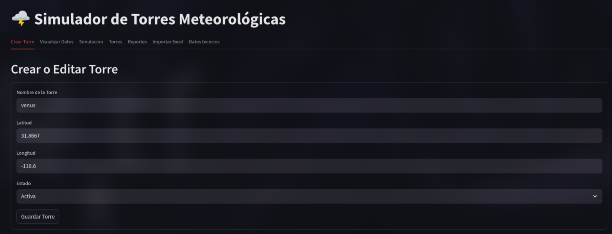
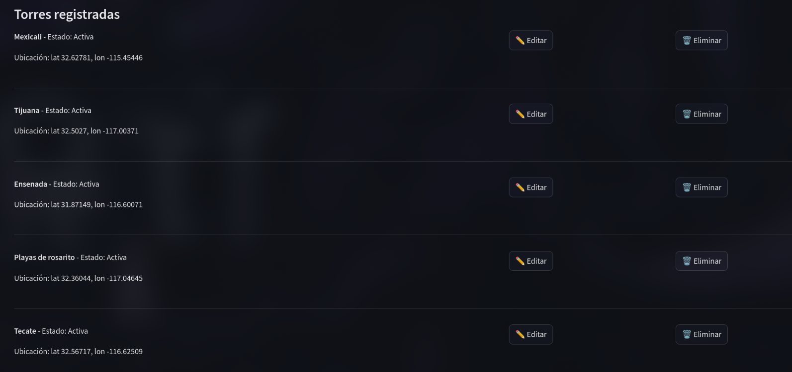
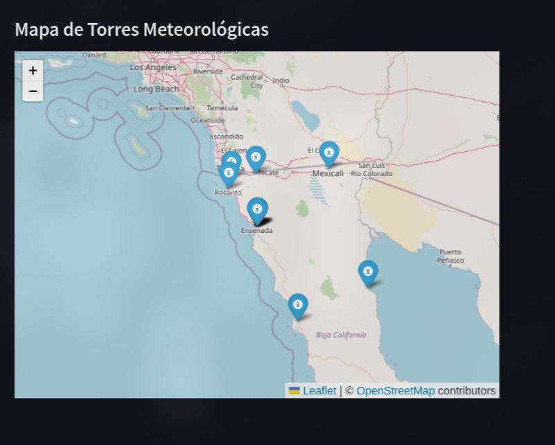
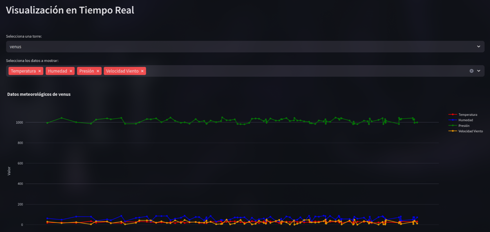
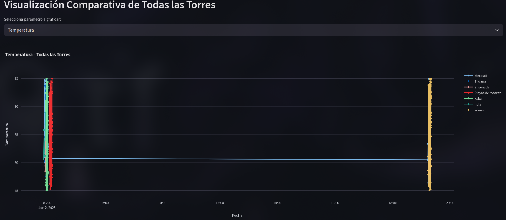
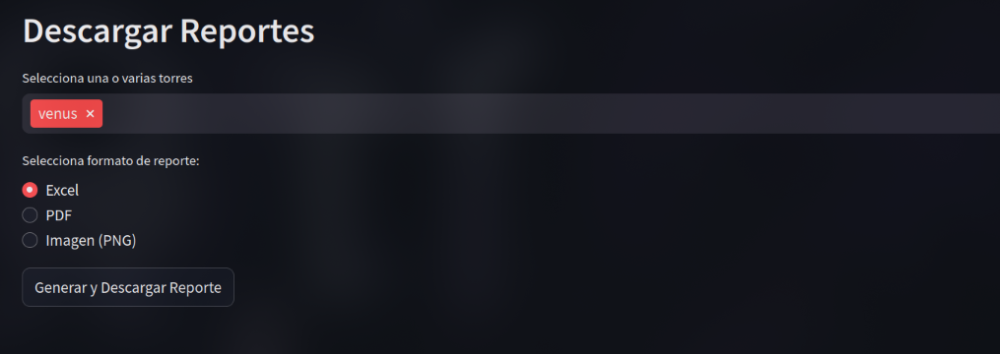
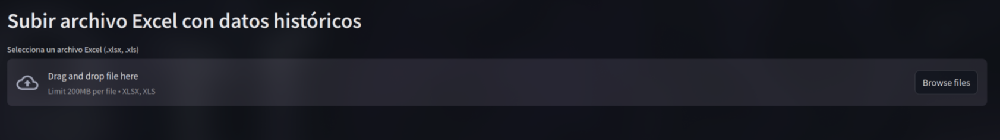
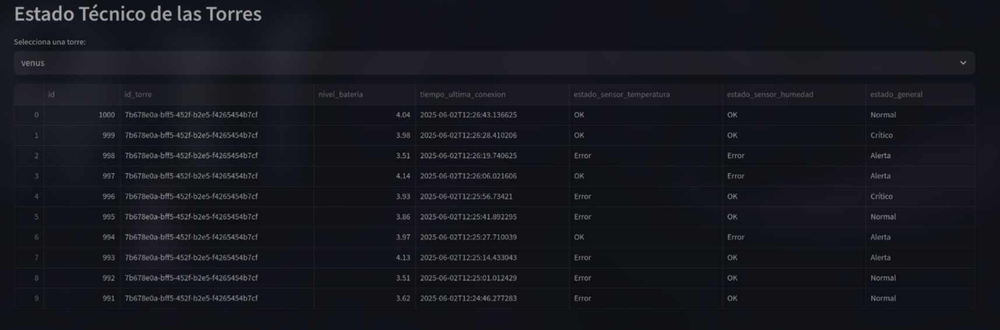

# Dashboard de Monitoreo de Torres Meteorológicas

Este proyecto consiste en el desarrollo de un Dashboard interactivo en Python para monitorear en tiempo real torres meteorologicas simuladas. El sistema generae datos meteorologicos, detecta fallas, gestiona datos historicos y permite la iteraccion a traves de una interfaz web y bot de telegram.

# 🛠️ Características Principales

## Simulador en tiempo real.

Torres meteorologicas que generan datos y fallos tecnicos usando multihilos.

## Base de datos integradas:

usa supabase, SQLite y un base de datos en PostgreSQL usando docker.

## Dashboard web:

Permite crear una torre, editarla y borrarla.

## Visualizaciones:

Graficas interactivas con Plotyl y mapas en tiempo real.

## Alertas automaticas:

Notificaciones en telegram sobre el estado general de las torres.

## Sistema de login.

## Bot de telegram.

# 📋 Requisitos

Python 3.9+.  
Base de datos:
SQLite.  
Cuenta y acceso a Supabase.  
Servidor propio PostgreSQL.  
Librerias python.  
streamlit  
dash  
plotly  
pandas  
sqlalchemy  
psycopg2

# 🚀 Instalación

1.

```
git clone https://github.com/JoseVelasco646/torres
```

cd torres

## 2. Crear Entorno virtual

```
python -m venv venv
linux : source venv/bin/activate
windows: venv\Scripts\activate
```

## 3. Instalar dependencias.

```
pip install -r requirements.txt
```

## 4. Instalar Docker

Para instalar docker nos dirigimos a esta pagina https://www.docker.com/.  
Creamos nuestro contenedor de postgres usando docker con el siguiente comando:

```docker run --name postgres-container \
  -e POSTGRES_USER=usuario \
  -e POSTGRES_PASSWORD=contraseña \
  -e POSTGRES_DB=midb \
  -p 5432:5432 \
```

## 5. Iniciar Programa.

Para iniciar el programa se debe de ejecutar primero el archivo crear_torre.py
`streamlit run crear_torre.py    `  
Despues ejecutar el bot de telegram.  
`python bot.py`

## Inicio.


Crear torre.

## Visualizar torres



## Mapa de las ubicaciones de las torres.



## Visualizar Datos de cada torre.



## Comparar datos de torres.



## Reportes de torres.



## Importar datos de excel.



## Estado tecnico de torre.


